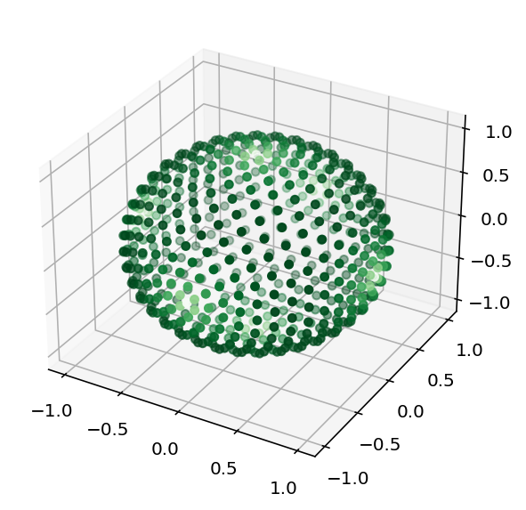

.. _user-interface:
.. index:: usage

Usage
=====

:program:`PyLebedev` exposes a library that contains the weights and positions of the Lebedev quadrature
scheme. One starts by constructing the :code:`PyLebedev` object after which the user can request the
library to supply said weights and positions as function of the desired integration order.

Obtaining points and weights
----------------------------

.. code:: python

    # import modules
    from pylebedev import PyLebedev
    import matplotlib.pyplot as plt

    # build library
    leblib = PyLebedev()

    # generate positions and weights for 41th order Lebedev quadrature
    r,w = leblib.get_points_and_weights(41)

    # visualize the points
    fig = plt.figure(dpi=144)
    ax = fig.add_subplot(1, 1, 1, projection='3d')
    ax.scatter3D(r[:,0], r[:,1], r[:,2], c=w, cmap='Greens')
    plt.tight_layout()
    plt.show()

    Distribution of points for the 41th order Lebedev quadrature

.. note::

    To get a list of possible orders and the associated number of sampling points
    per order, see :ref:`this section <nrorderpoints>`.

The grid points (positions) and the weights are given as a :code:`Nx3`` two-dimensional array
and an :code:`N`-element vector. Using the :code:`shape` functionality of :code:`numpy`,
we can readily see this as illustrated by the script below.

.. code:: python

    # import modules
    from pylebedev import PyLebedev
    import matplotlib.pyplot as plt

    # build library
    leblib = PyLebedev()

    # generate positions and weights for 41th order Lebedev quadrature
    r,w = leblib.get_points_and_weights(41)
    print(r.shape)
    print(w.shape)

.. code::

    (590, 3)
    (590,)

Performing integration
----------------------

Integration is most easily performed using the :code:`numpy` library. We start by defining
a function that takes a position on the unit sphere as its coordinate. Next, the function
is evaluated for all the point :code:`r` in the quadrature scheme and multiplied with the
weights :code:`w`. The sum of these products, in turn multiplied by a factor :math:`4 \pi`
constitutes the quadrature approximation of the integral. An example is provided in
the code below.

.. code:: python

    # import modules
    from pylebedev import PyLebedev
    import numpy as np

    # build library
    leblib = PyLebedev()

    # generate positions and weights for 9th order Lebedev quadrature
    r,w = leblib.get_points_and_weights(9)

    def f(x,y,z):
        return 1 + x + y**2 + x**2*y + x**4 + y**5 + x**2*y**2*z**2

    integral = 4.0 * np.pi * np.sum(w * f(r[:,0],r[:,1],r[:,2]))
    print(integral)

.. caution :: 

    Do not forget to multiply the result of the sum by the factor :math:`4\pi`.

For more complicated function evaluations, one can also make use of :code:`np.einsum`
as documented `here <https://numpy.org/doc/stable/reference/generated/numpy.einsum.html>`_.
An example of how one would evaluate the integral is provided below.

.. code:: python 

    integral = 4.0 * np.pi * np.einsum('i,i', w, f(r[:,0],r[:,1],r[:,2]))

.. _nrorderpoints:

Getting list of available orders and integration points
-------------------------------------------------------

To get the list of available orders, one can run

.. code:: python

    # import modules
    from pylebedev import PyLebedev
    import numpy as np

    # build library
    leblib = PyLebedev()

    print(leblib.get_orders_list())

which outputs::

    [3, 5, 7, 9, 11, 13, 15, 17, 19, 21, 23, 25, 27, 29, 31, 35, 41, 47, 53, 59, 65, 71, 77, 83, 89, 95, 101, 107, 113, 119, 125, 131])
        
In a similar fashion, to get the number of sampling points per order, one can run

.. code:: python

    # import modules
    from pylebedev import PyLebedev
    import numpy as np

    # build library
    leblib = PyLebedev()

    print(leblib.get_nrpoints_list())

which yields the following output::
        
    [6, 14, 26, 38, 50, 74, 86, 110, 146, 170, 194, 230, 266, 302, 350, 434, 590, 770, 974, 1202, 1454, 1730, 2030, 2354, 2702, 3074, 3470, 3890, 4334, 4802, 5294, 5810])